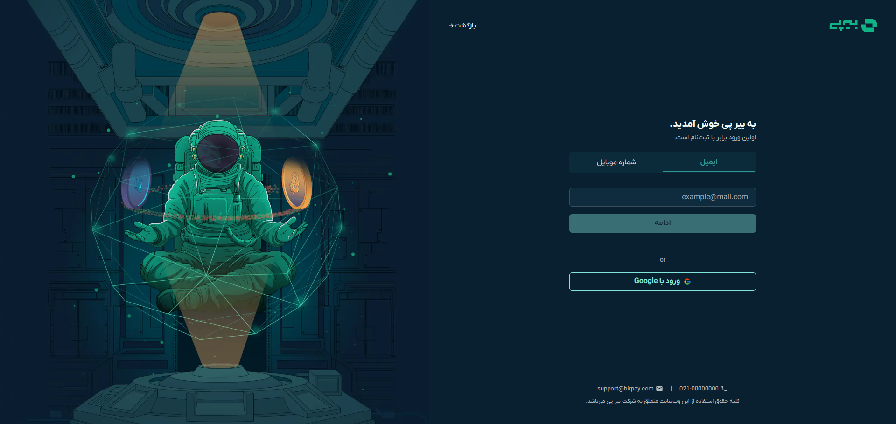
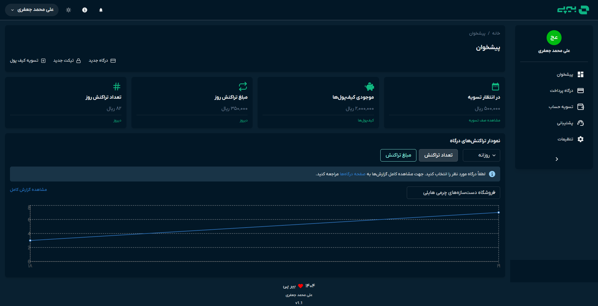
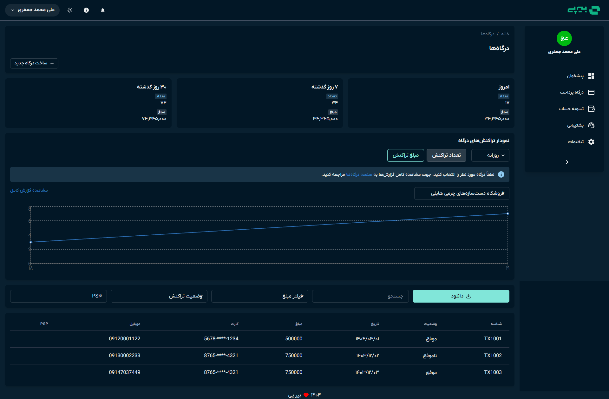
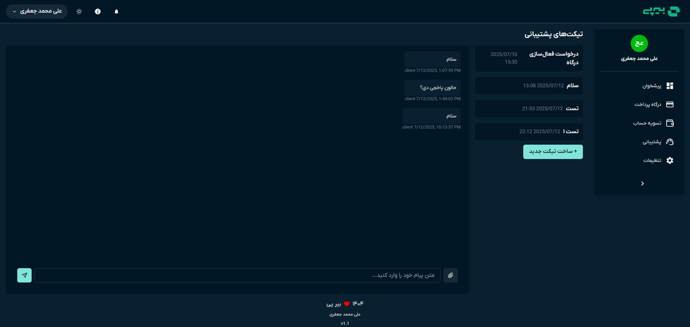
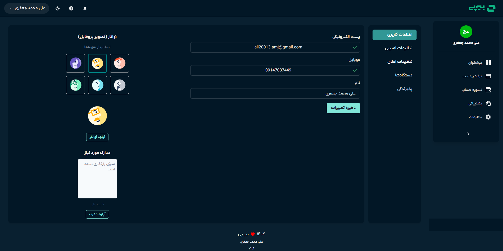

# BirPay Admin Panel 💳

A modern, responsive admin dashboard for managing payments, users, support tickets, and account settings — built with **React, TypeScript, Chakra UI, Redux Toolkit, and json-server**.

---

## ✨ Features

- ⚡ Modern architecture with TypeScript & Redux Toolkit
- 📱 Fully responsive UI using Chakra UI
- 💬 Live support ticket system with messaging
- 📊 Real-time charts and dashboard stats
- 🔍 Smart filtering & search for transactions
- ⚙️ User profile, security, and merchant settings
- 🧪 Local mock backend via `json-server`
- 🔔 Toast notifications, modals, theme switcher

---

## 🖼️ Screenshots

| Login page | Dashboard | Dashboard | Live Chat | Setting |
|----------|------------------|------------|------------|------------|
|  |  |  |  |  |

> Add images in the `/screenshots/` folder with the exact names above.

---


## 🚀 How to Run the Project

To run this project locally, follow these steps:

1. Clone the repository:
    ```bash
    git clone https://github.com/AliDiiv/CRM-Dashboard-BirPay.git
    ```

2. Navigate into the project directory:
    ```bash
    cd birpay-admin
    ```

3. Install the required dependencies:
    ```bash
    npm install
    ```

4. Start the development server:
    ```bash
    npm run dev

    ```

5. Vite-powered frontend on http://localhost:5173 the game.

6. json-server API on http://localhost:3000

## 🗂️ Fake API (db.json)

Mock data includes:
users

transactions

tickets

messages

dashboardStats

chartData

## You can run just the mock API using:   

    npx json-server --watch db.json --port 3000


## 🔗 Links
[](https://katherineoelsner.com/)
[](https://www.linkedin.com/)
[](https://twitter.com/)


